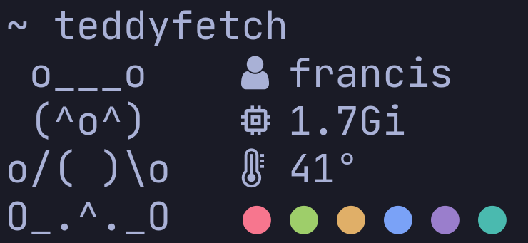

# Note
All the scripts are written to be interpreted explicitly by `dash`. This is because it is the fastest (to my knowledge) POSIX-compliant shell. If you would rather it run in another shell, feel free to change it. You can also use your /bin/sh symlink.

# Current scripts

### teddyfetch
suuuuuuper small fetch script with a cute ascii art teddy bear

here's a lil preview: 

